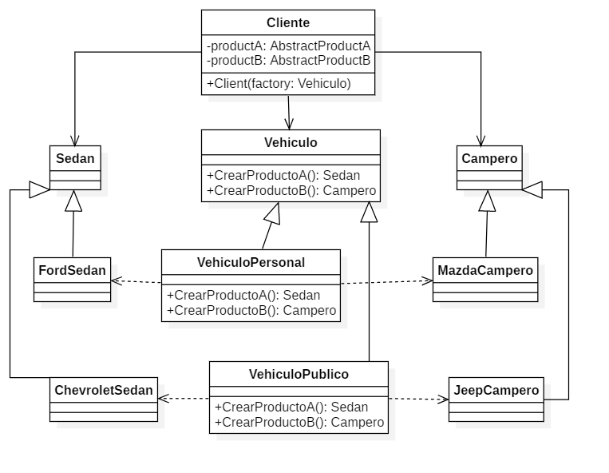

# Patron Abstract Factory

**Este es un ejemplo de la estructura de el patron Abstract Factpry trabajado en la Universidad EAFIT 2018-2**

# Autores
- Juan Camilo Marin Navia
- Federico Agudelo Mejia
- Stefania Zapata Osorio

# Problematica
El patron Abstract Factory toma el mismo concepto de Factory Method pero al proximo nivel. Un abstract factory es una clase que provee una interfaz para producir una familia de objetos. En lenguaje de programacion, esto se puede implementar con una interfaz o con una clase abstracta.
Este patron se puede usar por ejemplo para crear widgets o interfaces graficas multiplataforma(cada SO forma una familia diferente de objetos).

# Modelo de clases de la solucion implementada


# Lenguaje de programacion
**C# o C sharp**

# Ejecucion
**Este codigo solo muestra la esructura del patron, por lo cual solo ha sido diseñado con motivos de entender este patron**
```bash
# Clona este repositorio
git clone https://github.com/jcamilomnavia/Abstract-Factory-ST0250-2018-2
# Ve al directorio del repositorio
cd lar-electron
# Abrir con visual studio code
code .
```
